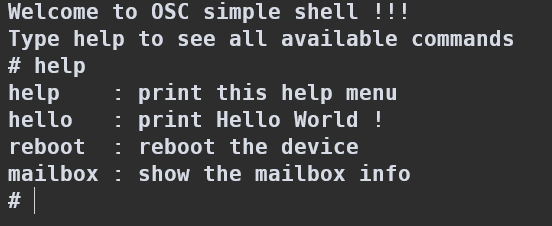
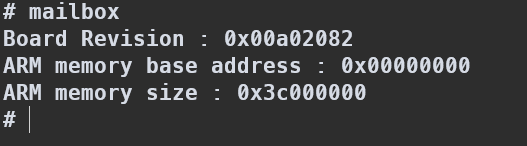

# OSC 2025 | Lab 1 : Hello World
## Emulate on qemu
### Usage
Compile and run:
```bash
make clean && make run
```
Or use the script:
```bash
./runqemu.sh
```
Alternatively, execute manually:
```bash
make clean && make 
qemu-system-aarch64 -m 1024 -M raspi3b -serial null -serial stdio -display none  -kernel kernel8.img
```

### Debug
Start debug mode:
```bash
make clean && make debug
```
Or use the debug script:
```bash
./debug.sh
```

## Demo
### Shell


### Mailbox


[](https://classroom.github.com/a/AaJgSZKl)