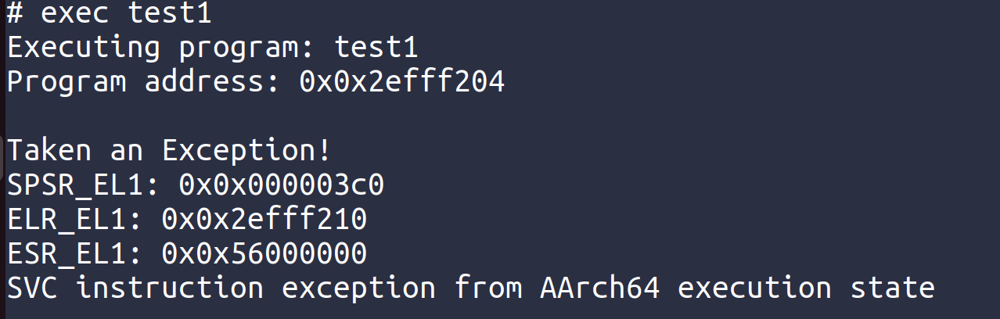
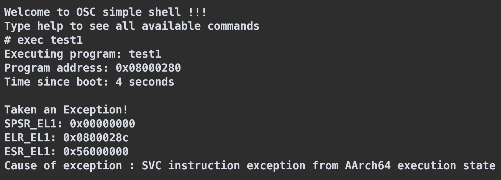
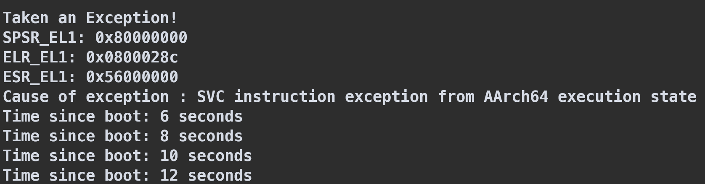

# OSC 2025 | Lab 3: Exception and Interrupts
> Todo :
> Advanced Exercise 2 - Concurrent I/O Devices Handling

## Basic Exercise 1: Exceptions
### EL2 to EL1

When the Raspberry Pi 3 boots, the CPU starts in EL2 (Hypervisor level). We need to transition to EL1 (Kernel level) for our operating system to run properly.

This is implemented in:
- `src/kernel/boot.S`: Contains the `from_el2_to_el1` function which sets up the necessary registers and uses the `eret` instruction to transition from EL2 to EL1.

The transition works by:
1. Setting up HCR_EL2 register to indicate that EL1 should use AArch64 state
2. Setting up SPSR_EL2 with the appropriate flags for EL1h mode with interrupts disabled
3. Setting ELR_EL2 to the return address
4. Using the `eret` instruction to switch to EL1

### EL1 to EL0

After the kernel is initialized, it needs to be able to run user programs in EL0 (User level). We've implemented a method to load user programs from the initramfs and execute them at EL0.

This is implemented in:
- `src/exception.S`: Contains the `exec_user_program` function that sets up the stack for the user program and transitions to EL0
- `src/cpio.c`: Contains `cpio_exec` which finds and loads a user program from the initramfs
- `src/shell.c`: Adds an `exec` command to the shell to run user programs

The transition works by:
1. Setting up the user stack pointer (SP_EL0)
2. Setting SPSR_EL1 to indicate EL0t mode with appropriate interrupt settings
3. Setting ELR_EL1 to the start address of the user program
4. Using `eret` to transition to EL0 and begin executing the user program

### EL0 to EL1

When a user program needs to request kernel services (via system calls) or when an exception occurs, the processor needs to transition from EL0 back to EL1. This is handled by our exception mechanism.

This is implemented in:
- `src/exception.S`: Contains the exception vector table and handler that saves register context
- `src/exception.c`: Contains the C function to process exceptions and display register contents

Key components:
1. **Exception Vector Table**: Aligned at 0x800 with entries for different exception types
2. **Context Saving**: Saves all general-purpose registers to preserve the user program's state
3. **Exception Handler**: Processes different exception types, including SVC instructions (system calls)
4. **Context Restoration**: Restores all registers before returning to the user program

### Building and Running
#### Compile User Program
```bash
cd user_program
make test1
```
It will put the executable of user program into rootfs/ and then create an CPIO file.

#### Emulate on qemu
```bash
make clean && make qemu
qemu-system-aarch64 -machine raspi3b -kernel kernel8.img -serial null -serial stdio -dtb bcm2710-rpi-3-b-plus.dtb -initrd initramfs.cpio
```
#### Deploy on a Raspi
```bash
make clean && make raspi
python3 send_kernel.py kernel8.img /dev/ttyUSB0 
```
#### Usage
When the system boots, you can use the `exec` command to run a user program from the initramfs. The user program will execute system calls (SVC) which will trigger exceptions and demonstrate the transition from EL0 to EL1 and back.




## Basic Exercise 2: Timer Interrupts
### Timer Configuration Registers

The timer is configured using several system registers:

- **`cntpct_el0`**: The timer's current count value
- **`cntp_cval_el0`**: A comparison value - when the timer count equals or exceeds this value, an interrupt is triggered
- **`cntp_tval_el0`**: A convenience register for setting the timer - it represents the difference between `cntp_cval_el0` and `cntpct_el0`
- **`cntfrq_el0`**: Contains the frequency of the system counter in Hz (ticks per second)

### Implementation Steps

1. **Enable the core timer**:
   - Set `cntp_ctl_el0` to 1 to enable the timer
   - Configure `cntp_tval_el0` to set the first timeout (2 seconds in our implementation)

2. **Enable the timer interrupt**:
   - Write to the Core 0 Timers interrupt control register (0x40000040)
   - Set bit 1 (`nCNTPNSIRQ`) to enable the Non-Secure Physical Timer interrupt

3. **Enable CPU interrupts**:
   - Configure `SPSR_EL1` to 0 when transitioning to EL0, enabling all interrupts
   - This ensures timer interrupts are only processed when running user programs at EL0

### Interrupt Handling Flow

When a timer interrupt occurs while executing at EL0:

1. The processor automatically:
   - Saves the current processor state to `SPSR_EL1`
   - Saves the return address to `ELR_EL1`
   - Jumps to the high level IRQ handler entry in the vector table (`irq_handler`)

2. The IRQ handler:
   - Saves all general-purpose registers to preserve context
   - Reads the Core 0 interrupt source register (0x40000060)
   - Checks if bit 1 is set, indicating a timer interrupt
   - If it's a timer interrupt, branches to the timer-specific handler

3. The timer-specific handler:
   - Calculates the elapsed time since boot using `cntpct_el0` and `cntfrq_el0`
   - Prints this time in seconds
   - Resets the timer for the next interrupt (2 seconds later)
   - Returns to the high-level IRQ handler

4. Then the high-level IRQ handler:
   - Restores all registers
   - Uses `eret` to return to the user program

### Timer Reset Mechanism
To set up periodic timer interrupts, we need to reset the timer in each interrupt handler:

```assembly
// Reset timer for next interrupt
mrs x0, cntfrq_el0      // Get timer frequency
lsl x0, x0, #1          // Multiply by 2 (shift left by 1)
msr cntp_tval_el0, x0   // Set timeout for 2 seconds
```

### Demo



## Basic Exercise 3: Peripheral Interrupts - Asynchronous UART

### Implementation Overview

We've implemented asynchronous UART communication using interrupts, which eliminates the need for busy-polling the UART device. This approach allows the CPU to perform other tasks while waiting for I/O operations, significantly improving efficiency.

### Control Flow and Concepts

#### Interrupt-Driven Architecture
Our implementation follows these key principles:

1. **Circular Buffers**: 
   - We use separate circular buffers for receive (RX) and transmit (TX) operations
   - Each buffer has head and tail pointers that wrap around when they reach the end
   - This design provides efficient memory usage and prevents data loss

2. **Two-Level Interrupt Controllers**:
   - The Raspberry Pi 3 has two levels of interrupt controllers
   - Second-level controller routes peripheral interrupts (including UART) to the first-level controller
   - First-level controller then routes the interrupt to the CPU core

3. **Interrupt Detection**:
   - When an interrupt occurs, the CPU checks the Core 0 interrupt source register
   - If a GPU interrupt is detected, it further checks the second-level controller
   - For UART interrupts, it verifies the AUX interrupt register to confirm it's from the mini UART

#### Data Flow for Reception (RX)
1. When data arrives at the UART, it generates an interrupt
2. The interrupt handler reads all available data from the UART FIFO
3. Data is stored in the RX circular buffer
4. The application can later retrieve data from the buffer using non-blocking read functions
5. This ensures no data is lost even if the application doesn't immediately read it

#### Data Flow for Transmission (TX)
1. When the application wants to send data, it writes to the TX circular buffer
2. If the TX interrupt wasn't enabled, it's enabled at this point
3. When the UART is ready to transmit, it generates a TX interrupt
4. The interrupt handler takes data from the TX buffer and writes it to the UART
5. When the TX buffer is empty, the TX interrupt is disabled
6. This allows data transmission to occur in the background

### Implementation Advantages

1. **Non-Blocking I/O**: The application doesn't have to wait for I/O operations to complete
2. **Better Throughput**: The CPU can perform other tasks while waiting for I/O
3. **Improved Responsiveness**: The system can respond to other events while handling I/O
4. **Buffer Management**: Circular buffers prevent data loss during burst transfers

### Testing

We've added an `auart` command to the shell to demonstrate the asynchronous UART functionality. The example:
- Initializes the asynchronous UART system
- Enables interrupts in EL1
- Provides an interactive session where you can type text
- Characters are echoed back immediately through the interrupt mechanism
- When you press Enter, it processes the entire line
- Type "exit" to return to the normal shell

## Advanced Feature: Timer Multiplexing

We've implemented a timer multiplexing mechanism that allows multiple timer events to be scheduled using a single hardware timer.

### Core Concepts

1. **One-Shot Timer with Callback Mechanism**:
   - Each timer request includes a callback function to be executed when the timer expires
   - This callback-based approach allows for various timed actions with a single hardware timer

2. **Timer Queue**:
   - Timers are stored in a sorted linked list based on their expiration time
   - The head of the list always represents the timer that will expire next
   - New timers are inserted in the correct position to maintain sorted order

3. **Timer Reprogramming**:
   - When a new timer is added, if it expires earlier than the current head of the queue, 
     the hardware timer is reprogrammed with the new timeout
   - This ensures the hardware timer always triggers for the next expiring timer

4. **Hardware Resource Management**:
   - Only one hardware timer is used regardless of how many software timers are scheduled
   - The timer interrupt is disabled when no timers are in the queue to save power

### The addTimer API

The `addTimer` function is the core API for the timer multiplexing system. Here's how it works:

1. **Memory Allocation**:
   - Allocates memory for a new timer structure using `simple_alloc`
   - The structure contains: expiration time, callback function, data pointer, and next pointer

2. **Timer Setup**:
   - Calculates the absolute expiration time based on current system time plus requested seconds
   - Associates the callback function with the timer
   - Stores the user-provided data which will be passed to the callback when executed

3. **Insertion in Timer Queue**:
   - Calls `insert_timer` to place the timer in the correct position in the sorted queue

The `insert_timer` function handles the actual insertion of the new timer in the queue:

1. **Critical Section Protection**:
   - Disables interrupts to protect the global timer queue from concurrent modifications

2. **Queue Position Determination**:
   - If the queue is empty, the new timer becomes the head of the queue
   - If the new timer expires earlier than the current head, it becomes the new head
   - Otherwise, it traverses the queue to find the correct insertion point (maintaining sorted order)

3. **Hardware Timer Adjustment**:
   - If the new timer becomes the head of the queue, reprograms the hardware timer
   - Calculates the appropriate timeout value based on the timer frequency and remaining time

4. **Interrupt Management**:
   - Enables the timer interrupt if it was the first timer added to the queue

### Timer Interrupt Handling

The `timer_mul_irq_handler` function manages timer interrupts and callback execution:

1. **Current Time Retrieval**:
   - Gets the current system time to determine which timers have expired

2. **Expired Timer Processing**:
   - Processes all timers that have expired (those with expiration time ≤ current time)
   - For each expired timer:
     - Removes it from the queue
     - Extracts its callback function and data
     - Executes the callback with the associated data

3. **Timer Reprogramming**:
   - After processing expired timers, if any timers remain in the queue:
     - Reprograms the hardware timer based on the next timer's expiration time
   - If the queue is empty:
     - Disables the timer interrupt to avoid unnecessary interrupts

4. **Hardware Register Interaction**:
   - Uses system registers to program the timer:
     - Reads the timer frequency (`cntfrq_el0`)
     - Calculates the difference between current time and next expiration
     - Writes to `cntp_tval_el0` to set the countdown value

### The setTimeout Command Example

We've added a `setTimeout` command that demonstrates this timer multiplexing capability:

```
setTimeout "TestingMSG" 5
```

This command uses the timer multiplexing system as follows:

1. **Memory Allocation**:
   - Allocates memory for a timeout message structure 
   - Stores the message and the creation timestamp

2. **Timer Registration**:
   - Calls `addTimer` with the `print_timeout_message` callback
   - Sets the specified timeout duration (in seconds)
   - Passes the message structure as the callback data

3. **Callback Execution**:
   - When the timer expires, `print_timeout_message` is called
   - It prints the message along with timing information:
     - Original message
     - Creation timestamp
     - Current timestamp
     - Elapsed time

4. **Concurrent Timers**:
   - Multiple timeouts can be set concurrently
   - Each will be processed independently when its timer expires
   - The printing order is determined by the expiration times, not the order of creation
  

## Advanced Exercise 2 - Concurrent I/O Devices Handling
> [!IMPORTANT]
> * Implement a task queue mechanism, so interrupt handlers can add their processing tasks to it.
> * Execute the tasks in the queue before returning to the user program with interrupts enabled.
> * Implement the task queue’s preemption mechanism.
